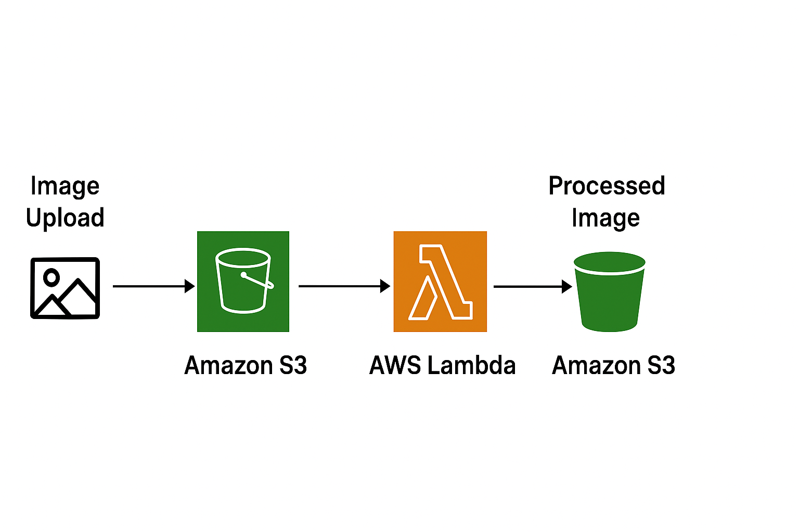

# Serverless Image Processing

## Author
**George Zakaria Saad**  
Email: georgezakaria.352@gmail.com 

## Project Description
This project resizes images automatically using AWS Lambda when uploaded to an S3 bucket.  
- Users upload images to the `original-images` bucket.  
- AWS Lambda processes the images (resize) and stores them in the `processed-images` bucket.

## AWS Services Used
- **Amazon S3**: Store original and processed images.  
- **AWS Lambda**: Execute image processing automatically.  
- **IAM Role**: Grant Lambda permission to access S3 buckets.  
- **CloudWatch**: Monitor Lambda execution logs.

## Architecture Diagram

## Learning Outcomes
- Building event-driven serverless applications.  
- Using Lambda with S3 triggers.  
- Managing security with IAM roles.  
- Understanding cost-efficient, scalable AWS solutions.

## How to Test
1. Upload an image to the `original-images` bucket.  
2. Wait for Lambda to process it automatically.  
3. Check the `processed-images` bucket for the resized image.
